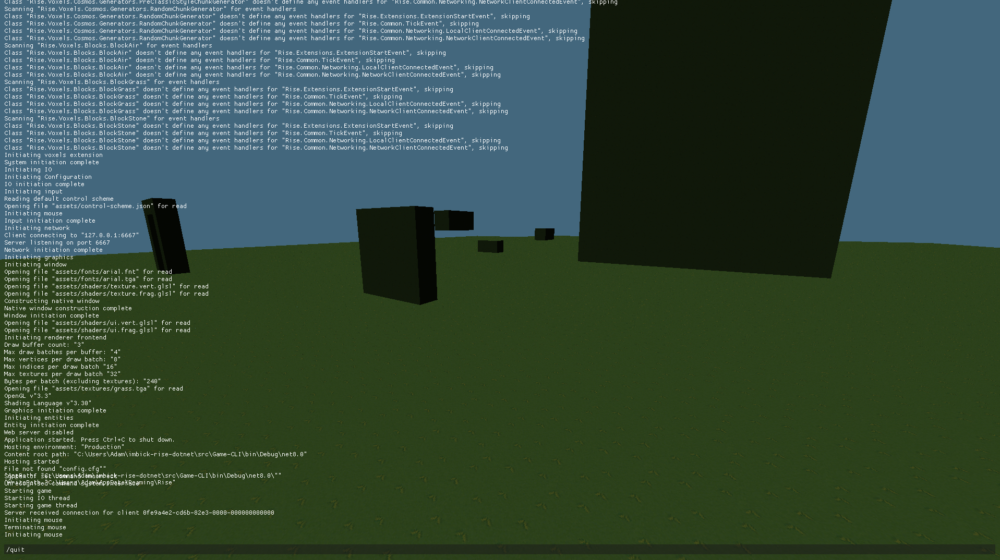

---
date: "2025-08-21T08:56:11+01:00"
draft: false
title: "Consoles for hacks"
layout: "background"
---
Always needed a console in this thing.  



I've never been a fan of anything which hides away the internals. Especially software.  

So I've always had a console implemented into Rise from the very beginning. It's been working well
but I recently decided to give it some more attention and some polish. It's using
[ImGui](https://github.com/ImGuiNET/ImGui.NET) for the UI elements but I plan on possibly replacing
this with my own UI library when viable.  

As you can see from the screenshot, the console supports commands and variables. So you'll be able
to do things like;

```bash
/set name Thresh
```

I plan on making the whole system very flexible with autofill and help prompts etc. but for now
it's pretty basic.