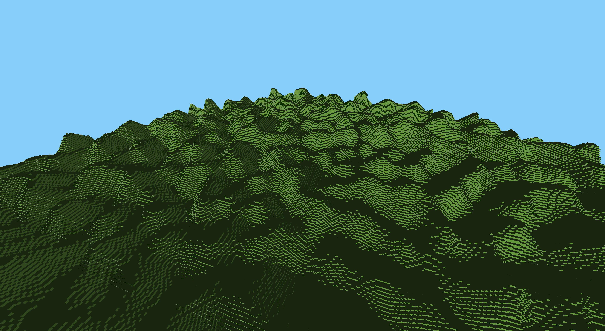
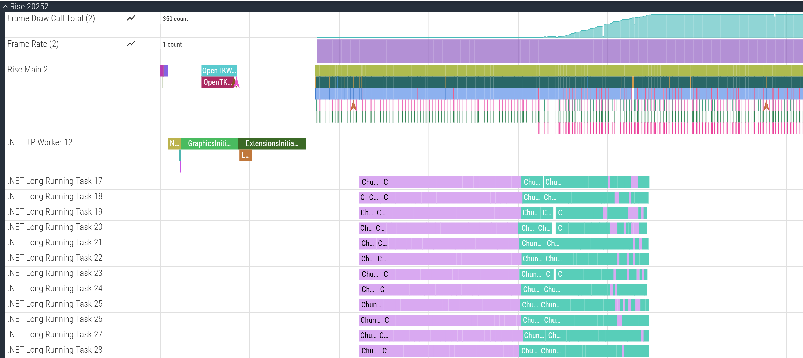

---
date: "2026-05-10T17:04:14+01:00"
draft: false
title: "Consoles for hacks"
layout: "background"
---
It's been a while. Months? That's not good enough.

The work has continued though. At pace. And I've rewritten a great many things. Many of which I hope to talk more about in coming posts.

But for now I would like to talk about multi-threading.

I have moved chunk loading, generation, meshing, and rendering into dedicated background worker threads. The game now dynamically creates as many as the system allows and then efficiently queues chunks as they are needed onto those workers and provides mechanisms for client code to respond as those chunks reach different parts of the pipeline. Such as uploading the mesh onto the graphics card once the meshing stage is complete. Or calculating collisions once the block data is loaded.

This in turn allowed me to focus my attention on the [Perlin noise](https://en.wikipedia.org/wiki/Perlin_noise) code I'd started a while back and fix some of the issues it was causing.

Behold.

To measure the performance of all this I've also adopted the [Perfetto](https://perfetto.dev/) tracing format to capture runtime performance data which I then stream out to disk with [protobuf](https://github.com/protocolbuffers/protobuf#protocol-buffers---googles-data-interchange-format).

This allows me to visualise the performance of the complex multithreaded architecture in a much more helpful way.

`Rise.Main` is the main thread which exclusively runs the OpenGL renderer (once the system level initialisation is complete).

Each of the `.NET Long Running Task ##` are the background workers which have been spun up to handle the chunk pipelines. 30 of them on this machine. The pink coloured slices on each of those tracks are the chunk loading stages (which is mostly perlin noise generation) which then transition into the green coloured meshing stages. You can see an obvious issue that none of the meshing starts until each worker has spent a large amount of time performing loading stages. The view distance is 16 chunks which gives a chunk total of just under 800 chunks. I need to make it so that each worker starts meshing as soon as it can.

I hope to go into much more detail on Perfetto at a later date. But next I want to turn my attention to the physics code to get collisions working better and input handling.